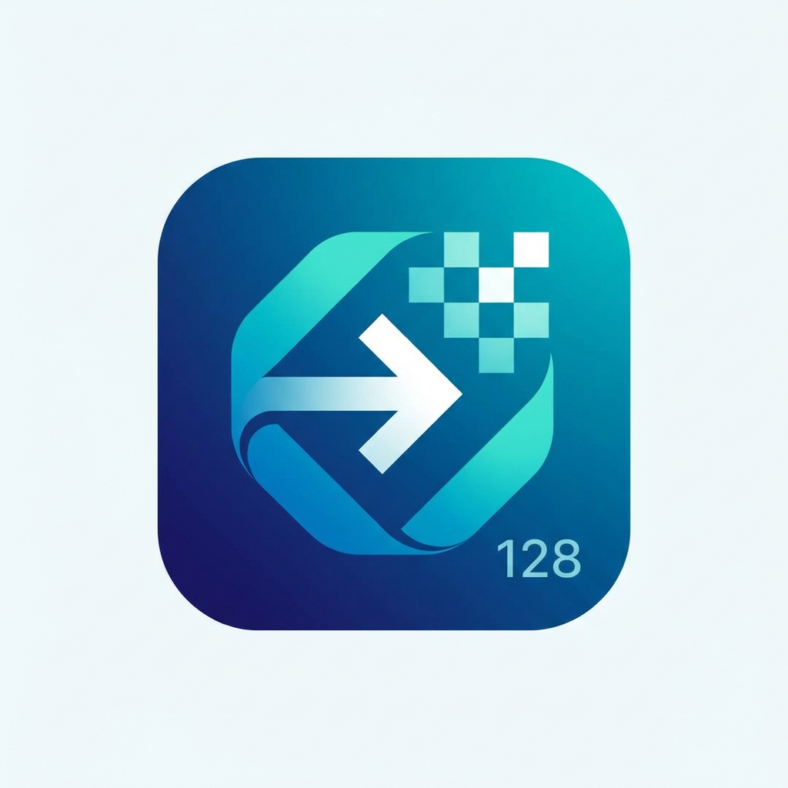

# Request Record

<p align="center">
  
</p>

<p align="center">
  <strong>专业的 HTTP 请求录制与分析工具</strong>
</p>

<p align="center">
  一款面向测试工程师和开发者的 Chrome 扩展程序，用于实时捕获、分析和导出网页 HTTP 请求，助力自动化测试用例编写与接口调试。
</p>

---

## 📋 目录

- [核心功能](#-核心功能)
- [主要特性](#-主要特性)
- [技术架构](#-技术架构)
- [安装说明](#-安装说明)
- [使用指南](#-使用指南)
- [数据导出](#-数据导出)
- [权限说明](#-权限说明)
- [开发信息](#-开发信息)

---

## 🎯 核心功能

Request Record 是一款强大的 HTTP 请求录制与监控工具，专为测试工程师和开发者设计，能够帮助您：

- **实时捕获** 浏览器中的所有 HTTP/HTTPS 请求
- **详细分析** 请求的完整信息（URL、方法、请求头、请求体、响应头、状态码、耗时等）
- **快速搜索** 通过关键词快速定位目标请求
- **灵活过滤** 支持域名、请求方法、状态码多维度过滤
- **批量操作** 一键选择、删除和导出多个请求记录
- **数据导出** 支持 JSON 和 HAR 格式导出，便于后续分析
- **cURL 生成** 自动生成可执行的 cURL 命令，方便接口重放
- **测试数据** 自动提取测试所需的结构化数据，加速自动化测试用例编写

---

## ✨ 主要特性

### 1️⃣ 实时 HTTP 请求捕获

- ✅ 自动监听所有网页发起的 HTTP/HTTPS 请求
- ✅ 智能过滤静态资源（JS、CSS、图片等），专注于 API 请求
- ✅ 过滤 OPTIONS 预检请求，减少干扰信息
- ✅ 支持域名白名单过滤，聚焦目标服务器
- ✅ 实时显示录制状态和请求计数

### 2️⃣ 完整的请求信息展示

每个请求记录包含：

| 信息类型 | 详细内容 |
|---------|---------|
| **基本信息** | 请求方法（GET/POST/PUT/DELETE/PATCH）、完整 URL、时间戳 |
| **请求头** | 包括 Cookie、Authorization、Content-Type 等所有请求头 |
| **请求体** | 支持 FormData 和 Raw 格式的请求体数据 |
| **响应头** | 完整的服务器响应头信息 |
| **状态码** | HTTP 状态码及响应结果 |
| **耗时统计** | 请求耗时（毫秒级），带性能等级标识（快速/中等/慢速） |
| **错误信息** | 请求失败时的详细错误描述 |

### 3️⃣ 强大的搜索与过滤功能

- 🔍 **实时搜索**：支持 URL 和请求方法的即时搜索，自动高亮匹配文本
- 📊 **方法筛选**：快速筛选 GET、POST、PUT、DELETE、PATCH 请求
- 🎨 **状态码筛选**：按 2xx、3xx、4xx、5xx 状态码范围筛选
- 🌐 **域名过滤**：模糊匹配域名，专注特定服务器的请求
- 🔔 **过滤指示器**：活跃过滤条件可视化提示

### 4️⃣ 批量操作支持

- ☑️ 批量选择模式，支持全选/反选
- 🗑️ 批量删除请求记录
- 📦 批量导出选中的请求数据
- 📊 实时显示已选择项数量

### 5️⃣ 数据导出功能

支持两种专业格式：

**JSON 格式导出**
```json
{
  "exportTime": "2026-02-05T08:30:00.000Z",
  "totalRequests": 10,
  "requests": [
    {
      "url": "https://api.example.com/users",
      "method": "GET",
      "timestamp": "2026-02-05T08:25:10.123Z",
      "statusCode": 200,
      "duration": 245,
      "requestHeaders": [...],
      "responseHeaders": [...],
      "requestBody": {...}
    }
  ]
}
```

**HAR 格式导出**
- 符合 HAR 1.2 标准规范
- 可导入 Chrome DevTools、Fiddler、Charles 等工具
- 包含完整的请求/响应时序信息

### 6️⃣ cURL 命令生成

自动生成可执行的 cURL 命令，包括：
- 完整的请求 URL
- 请求方法（-X）
- 所有请求头（-H）
- 请求体数据（--data-raw / --data-urlencode）

**示例输出：**
```bash
curl 'https://api.example.com/users' \
  -X POST \
  -H 'Content-Type: application/json' \
  -H 'Authorization: Bearer token123' \
  --data-raw '{"name":"张三","age":25}'
```

### 7️⃣ 自动化测试数据生成

自动提取并结构化测试数据，输出包含：
- 请求方法和 URL
- 路径（path）和主机（host）
- 查询参数（queryParams）
- 请求头（headers）
- 请求体（body）

**输出示例：**
```json
{
  "method": "POST",
  "url": "https://api.example.com/users?page=1",
  "path": "/users",
  "host": "api.example.com",
  "queryParams": {
    "page": "1"
  },
  "headers": {
    "Content-Type": "application/json",
    "Authorization": "Bearer token123"
  },
  "body": {
    "name": "张三",
    "age": 25
  }
}
```

### 8️⃣ 用户体验优化

- 🎨 现代化界面设计，操作直观友好
- ⚡ 虚拟滚动支持，流畅处理大量请求（500+ 条）
- 🔄 防抖搜索，减少性能消耗
- 📌 关键请求头高亮显示（Cookie、Authorization 等）
- 📋 一键复制功能，支持复制 URL、请求头、请求体、cURL 命令等
- 🔔 右键菜单快捷控制录制开关
- ⏱️ 自动清理机制，定期清除过期数据（默认保留 7 天）

---

## 🏗️ 技术架构

### 架构总览

```
┌─────────────────────────────────────────────────────────┐
│                     Chrome Extension                    │
├─────────────────────────────────────────────────────────┤
│                                                         │
│  ┌─────────────────┐         ┌────────────────────┐   │
│  │  Popup UI       │ ◄─────► │  Service Worker    │   │
│  │  (popup.js)     │  消息    │  (background.js)   │   │
│  └─────────────────┘  传递    └────────────────────┘   │
│         │                              │               │
│         ▼                              ▼               │
│  ┌─────────────────┐         ┌────────────────────┐   │
│  │  用户交互层     │         │  请求监听层        │   │
│  │  - 录制控制     │         │  - WebRequest API  │   │
│  │  - 请求列表     │         │  - 请求拦截        │   │
│  │  - 搜索过滤     │         │  - 数据捕获        │   │
│  │  - 详情展示     │         │  - 状态管理        │   │
│  └─────────────────┘         └────────────────────┘   │
│                                       │                │
│                                       ▼                │
│                          ┌────────────────────┐       │
│                          │  Chrome Storage    │       │
│                          │  本地持久化存储     │       │
│                          └────────────────────┘       │
└─────────────────────────────────────────────────────────┘
```

### 核心组件

| 组件 | 技术 | 职责 |
|-----|------|------|
| **Service Worker** | Chrome Extension V3 | 后台请求监听、状态管理、数据持久化 |
| **Popup UI** | HTML5 + CSS3 + Vanilla JS | 用户界面、数据展示、交互控制 |
| **WebRequest API** | chrome.webRequest | HTTP 请求拦截和监听 |
| **Storage API** | chrome.storage.local | 本地数据存储（支持最多 500 条记录） |
| **Message Passing** | chrome.runtime | 组件间通信机制 |
| **Context Menus** | chrome.contextMenus | 右键菜单快捷操作 |
| **Alarms API** | chrome.alarms | 定时自动清理任务 |

### 数据流设计

```
用户操作 → Popup UI → 消息传递 → Service Worker → WebRequest API
                                        ↓
                                  状态更新通知
                                        ↓
                        Popup UI ← 消息传递 ← Chrome Storage
```

### 性能优化策略

- **虚拟滚动**：超过 50 条请求自动启用虚拟列表渲染
- **防抖搜索**：200ms 防抖延迟，减少不必要的渲染
- **智能过滤**：自动过滤静态资源和 OPTIONS 预检请求
- **内存管理**：最大保留 500 条记录，超出自动清理最旧数据
- **事件驱动**：使用消息传递机制实时同步状态，无需轮询

---

## 📥 安装说明

### 方式一：开发者模式安装（推荐）

1. **下载源码**
   ```bash
   git clone https://github.com/your-username/Request-Record.git
   cd Request-Record
   ```

2. **打开 Chrome 扩展管理页面**
   - 在地址栏输入：`chrome://extensions/`
   - 或通过菜单：`更多工具` > `扩展程序`

3. **启用开发者模式**
   - 点击右上角的 "开发者模式" 开关

4. **加载扩展**
   - 点击 "加载已解压的扩展程序"
   - 选择 `Request-Record/extension` 目录
   - 确认加载

5. **完成**
   - 扩展图标将出现在浏览器工具栏
   - 点击图标即可使用

### 方式二：Chrome Web Store 安装

> 🚧 即将上线 Chrome Web Store，敬请期待

---

## 📖 使用指南

### 基本操作

1. **开始录制**
   - 点击扩展图标打开面板
   - 点击 "开始记录" 按钮
   - 或右键点击页面，选择 "⏺ 开始录制请求"

2. **查看请求**
   - 录制期间，所有 HTTP 请求将实时显示在列表中
   - 点击任意请求查看详细信息

3. **搜索请求**
   - 在搜索框中输入关键词（URL 或方法名）
   - 匹配的文本会自动高亮显示

4. **过滤请求**
   - 使用顶部的下拉菜单按方法或状态码筛选
   - 点击过滤按钮设置域名白名单

5. **查看详情**
   - 点击请求项打开详情抽屉
   - 查看完整的请求头、响应头、请求体等信息
   - 使用复制按钮快速复制数据

6. **批量管理**
   - 点击批量管理按钮进入选择模式
   - 勾选需要操作的请求
   - 使用批量删除或批量导出功能

7. **停止录制**
   - 点击 "停止记录" 按钮
   - 或右键点击页面，选择 "⏸ 停止录制请求"

8. **清除记录**
   - 点击垃圾桶图标清除所有记录
   - 删除操作需要确认

### 高级技巧

**域名过滤**
- 适用于只关注特定后端服务器的场景
- 支持模糊匹配，例如输入 `api.example` 可匹配 `api.example.com`、`api.example.cn` 等

**性能分析**
- 请求耗时显示带颜色标识：
  - 🟢 绿色：< 300ms（快速）
  - 🟡 黄色：300ms - 1000ms（中等）
  - 🔴 红色：> 1000ms（慢速）

**cURL 命令使用**
- 复制生成的 cURL 命令到终端即可重放请求
- 适用于快速接口测试和调试

**测试数据应用**
- 将导出的 JSON 测试数据直接用于自动化测试框架（如 Jest、Pytest、RestAssured）
- 减少手动编写测试用例的时间

---

## 📤 数据导出

### JSON 格式

适用场景：
- 自动化测试数据准备
- 接口文档生成
- 数据分析和统计

导出内容：
- 导出时间戳
- 请求总数
- 完整的请求数组（包含所有字段）

### HAR 格式

适用场景：
- 导入其他调试工具（Chrome DevTools、Fiddler、Charles）
- 性能分析
- 网络请求回放

符合标准：
- HAR（HTTP Archive）1.2 规范
- 包含时序信息（startedDateTime、time、timings）

---

## 🔐 权限说明

本扩展需要以下 Chrome API 权限：

| 权限 | 用途 | 必要性 |
|-----|------|--------|
| `webRequest` | 拦截和监听网络请求 | ✅ 核心功能 |
| `storage` | 本地数据持久化存储 | ✅ 核心功能 |
| `activeTab` | 访问当前标签页信息 | ✅ 必需 |
| `tabs` | 管理浏览器标签页 | ✅ 必需 |
| `contextMenus` | 创建右键菜单 | ⭐ 增强体验 |
| `alarms` | 定时任务（自动清理） | ⭐ 增强体验 |
| `<all_urls>` | 监听所有域名的请求 | ✅ 核心功能 |

**隐私承诺**：
- ✅ 所有数据仅存储在本地浏览器
- ✅ 不上传任何请求数据到远程服务器
- ✅ 不收集用户隐私信息
- ✅ 开源代码，接受社区审计

---

## 🛠️ 开发信息

### 项目结构

```
Request-Record/
├── extension/              # 扩展程序主目录
│   ├── background.js       # Service Worker 后台脚本
│   ├── manifest.json       # 扩展清单文件
│   ├── popup/              # 弹出窗口
│   │   ├── popup.html      # UI 结构
│   │   ├── popup.css       # 样式表
│   │   └── popup.js        # 交互逻辑
│   └── icons/              # 图标资源
│       ├── icon16.png
│       ├── icon48.png
│       └── icon128.png
└── README.md               # 项目文档
```

### 技术栈

- **核心技术**：Chrome Extension Manifest V3
- **前端**：原生 JavaScript（ES6+）、HTML5、CSS3
- **API**：Chrome WebRequest API、Storage API、Runtime API、Context Menus API、Alarms API
- **数据格式**：JSON、HAR（HTTP Archive 1.2）

### 浏览器兼容性

- ✅ Chrome 88+（推荐 Chrome 110+）
- ✅ Edge 88+（基于 Chromium）
- ⚠️ 其他 Chromium 内核浏览器（未测试）

### 本地开发

1. **克隆仓库**
   ```bash
   git clone https://github.com/your-username/Request-Record.git
   cd Request-Record
   ```

2. **安装扩展**（参考安装说明）

3. **修改代码**
   - 编辑 `extension/` 目录下的文件
   - 修改后需在 `chrome://extensions/` 页面点击 "重新加载" 按钮

4. **调试**
   - Service Worker：在扩展管理页点击 "Service Worker" 链接查看日志
   - Popup：在弹出窗口右键选择 "检查" 打开开发者工具

### 贡献指南

欢迎提交 Issue 和 Pull Request！

**提交前请确保**：
- 代码风格统一
- 功能完整测试
- 提交信息清晰

### 开发计划

- [ ] 支持 WebSocket 请求捕获
- [ ] 请求对比功能
- [ ] 导出为 Postman Collection
- [ ] 请求重放功能
- [ ] 自定义主题
- [ ] 国际化支持（英文版本）

---

## 📄 许可证

本项目采用 MIT 许可证，详见 [LICENSE](LICENSE) 文件。

---

## 🙏 致谢

感谢所有为本项目做出贡献的开发者和使用者！

---

## 📮 联系方式

- **问题反馈**：[GitHub Issues](https://github.com/your-username/Request-Record/issues)
- **功能建议**：[GitHub Discussions](https://github.com/your-username/Request-Record/discussions)

---

<p align="center">
  如果这个项目对您有帮助，请给个 ⭐ Star 支持一下！
</p>

<p align="center">
  Made with ❤️ by Request Record Team
</p>
